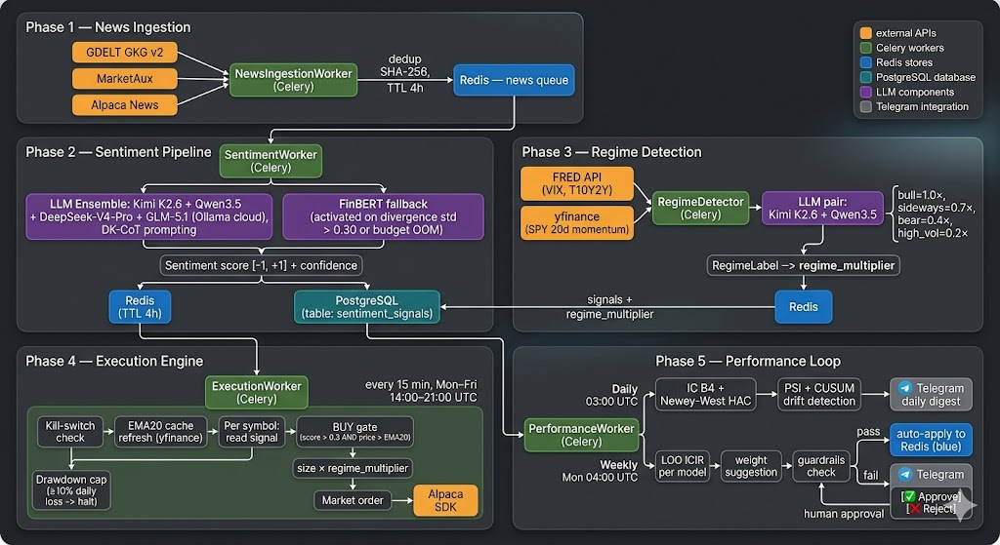

<div align="center">
  

  # Alembic — Open Source Finance

  **LLM-Based Algorithmic Trading System**

  *Alpha Miner paradigm: LLMs run offline, execution reads pre-computed signals from Redis*

  
  
  
</div>

---

## Architecture Overview

Alembic follows the **Alpha Miner paradigm**: all LLM inference happens offline, asynchronously, well before any trade decision. The execution engine never calls an LLM — it reads pre-computed signals from Redis. This decoupling means latency, LLM API outages, and budget exhaustion never block order placement.

The system runs as five loosely-coupled phases, each driven by a separate Celery worker:



```
╔══════════════════════════════════════════════════════════════════════════════╗
║  PHASE 1 — NEWS INGESTION  (every 15 min, Mon–Fri market hours)             ║
║                                                                              ║
║  GDELT GKG v2 ──┐                                                            ║
║  MarketAux ─────┼──► NewsIngestionWorker ──► Redis news queue               ║
║  Alpaca News ───┘         (dedup via SHA-256 hash, TTL 4 h)                 ║
╚══════════════════════════════════════════════════════════════════════════════╝
                                    │ (consumed as fast as produced)
                                    ▼
╔══════════════════════════════════════════════════════════════════════════════╗
║  PHASE 2 — SENTIMENT PIPELINE  (every 15 min, Mon–Fri market hours)         ║
║                                                                              ║
║  Redis news queue ──► SentimentWorker                                        ║
║                           │                                                  ║
║                           ├──► LLM Ensemble (Kimi K2.6 + Qwen3.5 +          ║
║                           │    DeepSeek-V4-Pro + GLM-5.1, Ollama cloud)      ║
║                           │       DK-CoT prompting, budget-gated             ║
║                           │       divergence check (std > 0.30)              ║
║                           │                                                  ║
║                           └──► FinBERT fallback (divergence / budget OOM)   ║
║                                                                              ║
║                      polarity score [-1, +1] + confidence                   ║
║                           │                   │                              ║
║                           ▼                   ▼                              ║
║                    Redis (TTL 4h)       PostgreSQL audit                     ║
║                  sentiment:signal:{sym}  sentiment_signals table             ║
╚══════════════════════════════════════════════════════════════════════════════╝
                                                                               
╔══════════════════════════════════════════════════════════════════════════════╗
║  PHASE 3 — REGIME DETECTION  (daily, Mon–Fri 07:00 UTC)                     ║
║                                                                              ║
║  FRED API ─────────────┐                                                     ║
║  (VIX, T10Y2Y spread)  ├──► MacroSnapshot ──► LLM pair (Kimi K2.6 + Qwen3.5)║
║  yfinance (SPY 20d) ───┘       consensus vote → RegimeLabel                 ║
║                                                                              ║
║  RegimeLabel ──► regime_multiplier written to Redis                          ║
║    bull=1.0×  │  sideways=0.7×  │  bear=0.4×  │  high_vol=0.2×             ║
╚══════════════════════════════════════════════════════════════════════════════╝
                   │                    │
                   │ multiplier         │ signals
                   ▼                    ▼
╔══════════════════════════════════════════════════════════════════════════════╗
║  PHASE 4 — EXECUTION ENGINE  (every 15 min, Mon–Fri 14:00–21:00 UTC)       ║
║                                                                              ║
║  ExecutionWorker per tick:                                                   ║
║    1. Kill-switch check   → abort if active                                  ║
║    2. EMA20 cache refresh → SPY + watchlist prices (yfinance)                ║
║    3. Drawdown cap check  → halt + alert if daily loss ≥ 10%                ║
║    4. For each symbol:                                                        ║
║         a. Read sentiment signal from Redis (freshness ≤ 30 min)            ║
║         b. Stop-loss check (if open position and price ≤ stop)               ║
║         c. BUY gate: score > 0.3 AND price > EMA20                          ║
║         d. Position size = base × regime_multiplier                          ║
║         e. Place market order via Alpaca SDK                                 ║
╚══════════════════════════════════════════════════════════════════════════════╝
                                    │
                                    ▼ (daily + weekly async)
╔══════════════════════════════════════════════════════════════════════════════╗
║  PHASE 5 — PERFORMANCE & WEIGHT OPTIMISATION LOOP                          ║
║                                                                              ║
║  Daily (03:00 UTC):  PerformanceWorker                                       ║
║    • Composite IC B4 + Newey-West HAC → IC report                           ║
║    • PSI + CUSUM drift detection → circuit breaker if regime shift          ║
║    • Post-mortem diagnostics → Telegram daily digest                        ║
║                                                                              ║
║  Weekly (Mon 04:00): LOO ICIR per model ──► weight suggestion               ║
║    • Guardrails: VIX < 30, no active freeze, weights in [0.10, 0.70]        ║
║    • Auto-apply if all guardrails pass                                       ║
║    • Otherwise → Telegram inline keyboard: [✅ Approve] [❌ Reject]         ║
║      Human approves → weights written to Redis → applied next tick          ║
╚══════════════════════════════════════════════════════════════════════════════╝
```

### Phase 1 — News Ingestion

Every 15 minutes during US market hours, Alembic pulls financial news from three independent sources, each chosen for a different reason:

- **GDELT GKG v2** — a free, open global news graph that ingests tens of thousands of outlets worldwide. Alembic fetches the bulk CSV files published every 15 minutes, filters for English-language financial themes, and extracts article URLs, tone scores, and entity mentions. Because GDELT is a secondary index (not a primary publisher), articles can appear with a short lag, but the breadth is unmatched for zero cost.
- **MarketAux** — a paid news API that pre-tags articles with ticker symbols. Using pre-tagged data reduces the number of LLM tokens needed for ticker extraction and increases precision: MarketAux has already resolved "Apple" → `AAPL` before the article reaches the sentiment pipeline.
- **Alpaca News** — the broker's own news feed, surfaced via the same SDK used for order placement. Being broker-native means the latency between article publication and ingestion is minimal, and there is no additional authentication surface.

Each article is fingerprinted with a **SHA-256 hash of its URL** before being pushed to a Redis list. If the hash already exists in a Redis set (TTL: 4 hours), the article is silently dropped — so the same story arriving from two sources in the same 15-minute window is processed exactly once. This deduplication is critical: without it, a major earnings announcement covered by 50 outlets would trigger 50 redundant LLM inference calls and inflate the daily budget.

For SEC regulatory filings (8-K, 10-Q), a separate `SecEdgarConnector` polls the EDGAR RSS feed and pushes filings into the same Redis queue. Filings go through an identical dedup-then-enqueue flow but are tagged with `source=sec_edgar` so downstream consumers can apply different prompt templates optimised for structured financial disclosures.

Company names that appear in GDELT entity fields — but are not pre-tagged with a ticker — are resolved to exchange symbols via a **PostgreSQL lookup table** (`ticker_extractor.py`). Unknown names fall through gracefully: the article is enqueued with an empty `asset_tags` list and the sentiment pipeline assigns it to a "market-wide" bucket rather than a specific symbol.

### Phase 2 — Sentiment Pipeline

The `SentimentWorker` is the core intelligence of Alembic. It consumes articles from the Redis queue and produces a numeric signal for each ticker mentioned.

**Scoring formula.** Every LLM response is reduced to two numbers: `polarity` ∈ [−1, +1] (directional sentiment) and `confidence` ∈ [0, 1] (model certainty). The tradeable signal is their product:

```
score = polarity × confidence
```

This formula correctly handles uncertainty: a strong positive call with low confidence yields a small score, while a moderate positive call with high confidence yields a larger one. A model that says "slightly bullish, very certain" outranks one that says "extremely bullish, almost guessing."

**LLM ensemble.** Four models are queried in parallel via Ollama cloud: Kimi K2.6, Qwen3.5, DeepSeek-V4-Pro, and GLM-5.1. Each receives the same article text after passing through `sanitize_text()` — a pre-processing step that strips BiDi override characters, Unicode homoglyphs, and hidden sentiment-inverting injections that could corrupt NER or flip the model's conclusion. Every prompt uses **DK-CoT** (Domain Knowledge Chain-of-Thought): the model is instructed to act as a buy-side analyst, reason through cash flows and competition before reaching a verdict, provide explicit bull and bear cases, and return a structured JSON object. Forcing structured output makes parsing deterministic and eliminates the need for regex heuristics on free-form text.

**Divergence check.** After all four scores arrive, the worker computes the standard deviation of the ensemble. If `std > 0.30`, the models have reached meaningfully different conclusions about the same article — which is itself a signal of ambiguity. Rather than averaging a high-variance ensemble into a false consensus, the worker discards the LLM results and falls back to FinBERT.

**Budget enforcement.** The `LLMBudgetTracker` keeps a Redis counter of spend per model per calendar day, estimated from token counts and per-model cost rates. When a model's daily budget is exhausted, it is excluded from the ensemble for the remainder of the day. If all four models are excluded, the system falls back to FinBERT automatically — inference never blocks.

**FinBERT fallback.** FinBERT is a BERT model fine-tuned on financial text that runs locally (no API call, no marginal cost). Its output probabilities (positive / negative / neutral) are mapped to a confidence score using **entropic confidence**: `1 − H(p) / log(3)`, where H(p) is the Shannon entropy of the three-class distribution. A peaked distribution (confident prediction) gives high confidence; a flat distribution (model is unsure) gives low confidence and a near-zero score.

**Persistence.** The final signal is written to two stores simultaneously: Redis (`sentiment:signal:{sym}`, TTL 4 hours) for the execution engine to read in real time, and PostgreSQL (`sentiment_signals` table) as a permanent audit record. Individual per-model outputs are also persisted to `llm_responses`, enabling post-hoc analysis of which models were most predictive and backtesting of alternative ensemble weighting strategies.

### Phase 3 — Regime Detection

Market regime determines how aggressively Alembic sizes positions. Even a strongly positive sentiment signal should result in a small order when the broader macro environment is deteriorating — because in a bear market or volatility spike, even fundamentally sound companies get sold off indiscriminately.

Once per trading day at **07:00 UTC** (before US pre-market), a `RegimeDetector` worker fetches three macro indicators:

- **VIX** (CBOE Volatility Index) from FRED — measures implied volatility of S&P 500 options; spikes signal fear and systemic risk
- **T10Y2Y spread** (10-year minus 2-year Treasury yield) from FRED — a negative spread (yield curve inversion) is historically associated with recessions
- **SPY 20-day price momentum** from yfinance — whether the broad market has been trending up or down over the past month

These indicators are packaged into a `MacroSnapshot` and sent to a **two-model LLM pair** (Kimi K2.6 + Qwen3.5). Each model is asked to independently classify the current regime as one of four labels:

| Label | Multiplier | Typical conditions |
|-------|-----------|-------------------|
| `bull` | 1.0× | Low VIX, positive spread, SPY trending up |
| `sideways` | 0.7× | Moderate VIX, flat spread, SPY range-bound |
| `bear` | 0.4× | Elevated VIX, negative spread, SPY declining |
| `high_vol` | 0.2× | VIX spike (>30), extreme moves in either direction |

If both models agree, the consensus label is used. If they disagree, the system defaults to the more conservative label. The resulting `regime_multiplier` is written to Redis under a key that the execution engine reads before every order — no code change or restart is required for the new multiplier to take effect.

Running regime detection daily rather than per-tick is an intentional design choice: macro conditions evolve over days and weeks, not minutes. Running it intraday would introduce noise without adding signal, and would double the LLM cost without a corresponding improvement in regime accuracy.

### Phase 4 — Execution Engine

The `ExecutionWorker` is intentionally the dumbest component in the system. By the time it runs, all the complex reasoning has already been done by the LLM ensemble (Phase 2) and the regime detector (Phase 3). The execution engine simply reads pre-computed numbers and applies a sequential safety checklist before placing any order via the Alpaca SDK.

The checklist runs in strict order every 15 minutes during market hours (14:00–21:00 UTC, Mon–Fri). Each step is a gate: if it fails, the entire tick is aborted.

**1. Kill-switch check.** A Redis flag (`kill_switch`) can be set by an operator, by an automated alert, or by the drawdown cap logic. If the flag is active, the worker logs the skip and exits immediately. No orders are placed, no positions are modified. This provides a single point of control for emergencies.

**2. EMA20 cache refresh.** The worker fetches the latest prices for SPY and the watchlist from yfinance, computes the 20-day exponential moving average, and writes the result to a local in-process cache. This cache is used in the BUY gate below to filter out entries against the trend.

**3. Drawdown cap check.** The worker queries the Alpaca portfolio history API for today's equity curve. If the portfolio is down ≥ 10% from the day's opening value, it sets the kill-switch, sends a CRITICAL Telegram alert, and halts. This cap prevents a runaway sequence of losing trades from compounding into a catastrophic loss within a single session.

**4. Per-symbol loop.** For each symbol in the configured watchlist:

- **Signal freshness**: reads the sentiment signal from Redis. If the signal's timestamp is older than 30 minutes, it is treated as stale and the symbol is skipped for this tick. A stale signal means the sentiment pipeline has not processed any new articles for this symbol recently — trading on old information is worse than not trading at all.
- **Stop-loss check**: if an open position exists and the current price has fallen to or below the stop-loss level (set at order time), a market SELL is issued immediately, before any BUY logic runs.
- **BUY gate**: a new long entry is opened only if `score > 0.3` (the sentiment signal is meaningfully positive) **and** `price > EMA20` (price is above the 20-day moving average, confirming the stock is in an uptrend). Both conditions must hold simultaneously. The score threshold of 0.3 filters out weak or near-neutral signals; the EMA filter prevents buying into a downtrend on sentiment alone.
- **Position sizing**: `order_notional = base_position_size × regime_multiplier`. The base size is configured per account; the multiplier (0.2× to 1.0×) is applied from Phase 3. An existing open position on a symbol is not added to — the system is idempotent and never pyramids into a winning trade.

### Phase 5 — Performance & Weight Optimisation

Phase 5 closes the feedback loop. It answers two questions on a recurring schedule: "Is the signal still working?" and "Should the ensemble weights change?"

**Daily IC report (03:00 UTC).** The `PerformanceWorker` computes the **Information Coefficient (IC)** for the previous trading day — the Spearman rank correlation between each symbol's sentiment score at market open and its forward return by close. A positive IC means the signal predicted direction correctly on average; IC near zero means the signal has no predictive value; negative IC means it was systematically wrong.

To correct for the autocorrelation in financial returns (yesterday's return predicts today's), IC is computed using the **composite B4 estimator** with **Newey-West HAC** (Heteroskedasticity and Autocorrelation Consistent) standard errors. This gives a statistically honest confidence interval around the IC estimate rather than overstating its significance.

The IC report is sent as a Telegram digest. An IC below a configurable threshold for N consecutive days triggers an automatic circuit breaker and a CRITICAL alert — the system pauses new entries until an operator reviews.

**Drift detection.** Alongside the IC, the worker runs two statistical tests on the signal distribution:

- **PSI** (Population Stability Index) compares the current distribution of scores against the historical baseline. PSI > 0.10 is a yellow flag (regime shift likely); PSI > 0.25 is a red flag that triggers the circuit breaker.
- **CUSUM** (Cumulative Sum Control Chart) detects sustained directional drift — a gradual shift in mean score that PSI might miss if the shape of the distribution stays constant.

If either test fires at the red threshold, new entries are halted and the operator receives a diagnostic post-mortem report via Telegram.

**Weekly weight optimisation (Monday 04:00 UTC).** The worker computes the **ICIR** (IC Information Ratio = mean IC / standard deviation of IC) for each model in the ensemble, using Leave-One-Out cross-validation over a 30-day rolling window. Models with a higher ICIR have been more consistently predictive and should receive a larger share of the ensemble vote.

New weights are proposed subject to guardrails: no single model can exceed 70% weight (`weight_cap`), no model can drop below 10% (`weight_floor`), and rebalancing is blocked if VIX is above threshold or a drawdown freeze is active. These guardrails prevent the optimiser from concentrating entirely on a model that happened to be lucky in a specific regime.

If all guardrails pass, the weights are **auto-applied** and written to Redis instantly — the next tick runs with the updated ensemble. If any guardrail trips, the operator receives a Telegram message with inline **[✅ Approve] / [❌ Reject]** buttons. Approval writes the weights to Redis immediately; rejection discards the proposal. This human-in-the-loop mechanism ensures that automated rebalancing cannot happen during volatile or anomalous market conditions without explicit operator sign-off.

### Core Principles

| Principle | Description |
|-----------|-------------|
| **LLM Offline** | No LLM is ever called synchronously inside the trading loop |
| **Signal Caching** | Signals cached in Redis with 4-hour TTL; stale signals are skipped, not used |
| **Audit Trail** | Every signal written to PostgreSQL — the foundation for IC/ICIR calculation and backtesting |
| **Graceful Degradation** | Redis OOM handled silently, FinBERT fallback on ensemble divergence, circuit breakers on drift |
| **Regime-Aware Sizing** | `regime_multiplier` (1.0×, 0.7×, 0.4×, 0.2×) applied to position size based on macro conditions |
| **Human-in-the-Loop** | Weight updates require Telegram approval when guardrails (VIX, drawdown, freeze) trigger |
| **Drawdown Cap** | Daily loss ≥ 10% auto-activates kill-switch + sends Telegram CRITICAL alert |
| **Budget Enforcement** | Daily LLM spend is tracked per-model; ensemble falls back to FinBERT when budget is exhausted |

---

## Tech Stack

| Component | Technology | Purpose |
|-----------|------------|---------|
| **LLM Ensemble** | Kimi K2.6, Qwen3.5, DeepSeek-V4-Pro, GLM-5.1 (via Ollama cloud) | Sentiment analysis with DK-CoT |
| **Fallback Model** | FinBERT | Fallback when ensemble diverges or budget exhausted |
| **Task Queue** | Celery + Redis | Background task processing |
| **Cache** | Redis | Signal caching, kill-switch, counters, regime state |
| **Database** | PostgreSQL | Audit trail, performance metrics, weight change log |
| **API** | FastAPI | Signals, admin, performance, and weights endpoints |
| **Execution** | Alpaca SDK (paper + live) | Order placement, stop-loss, drawdown cap |
| **Notifications** | Telegram Bot | Alerts, daily reports, weight approval via inline keyboard |
| **Macro Data** | FRED API + yfinance | VIX, T10Y2Y yield curve, SPY 20d momentum |

---

## Project Structure

```
Alembic/
├── src/
│   ├── config.py              # Centralised config (Pydantic) — env vars, guardrails
│   ├── models/
│   │   ├── signals.py         # SentimentResult, LLMSentimentOutput
│   │   ├── news.py            # NewsItem
│   │   ├── performance.py     # PerformanceReport, PostMortem
│   │   └── regime.py          # RegimeState, RegimeOutput, MacroSnapshot, RegimeLabel
│   ├── llm/
│   │   ├── client.py          # LLMClient ABC + OllamaKimiClient, OllamaQwen35Client, OllamaDeepseekClient, OllamaGlmClient
│   │   ├── ensemble.py        # EnsembleAggregator, run_ensemble_query
│   │   ├── finbert.py         # FinBERT fallback + entropic confidence mapping + score_articles()
│   │   └── budget.py          # LLMBudgetTracker (daily budget enforcement)
│   ├── connectors/
│   │   ├── base.py            # NewsConnector ABC
│   │   ├── deduplicator.py    # Redis hash-based deduplication
│   │   ├── gdelt_gkg.py       # GDELT GKG v2 bulk connector
│   │   ├── gdelt.py           # GDELT news connector
│   │   ├── marketaux.py       # MarketAux news connector
│   │   ├── alpaca_news.py     # Alpaca news connector
│   │   ├── macro.py           # FRED API: VIX, yield curve, SPY momentum
│   │   ├── ticker_extractor.py# Company name → ticker (PostgreSQL lookup)
│   │   └── sec_edgar.py       # SEC EDGAR 8-K/10-Q filing connector
│   ├── store/
│   │   ├── redis_store.py     # RedisStore: signals, kill-switch, weights, regime
│   │   └── pg_store.py        # PostgreSQLStore: audit, IC data, weight update log
│   ├── performance/
│   │   ├── ic.py              # Composite IC B4 + Newey-West HAC correction
│   │   ├── weights.py         # LOO ICIR + smoothing + guardrails
│   │   ├── drift.py           # PSI + CUSUM + circuit breakers
│   │   ├── postmortem.py      # Trigger logic + diagnostics
│   │   └── threshold.py       # Bucket IC + threshold suggester
│   ├── workers/
│   │   ├── celery_app.py      # Celery config + beat schedule (8 registered tasks)
│   │   ├── sentiment.py       # SentimentWorker: news → LLM → Redis/PG
│   │   ├── execution.py       # ExecutionWorker: signals → Alpaca orders + drawdown cap
│   │   ├── performance.py     # PerformanceWorker: IC, weights, drift, auto-apply
│   │   ├── regime.py          # RegimeDetector: macro → LLM pair → regime → Redis
│   │   ├── ingestion.py       # NewsIngestionWorker: GDELT/MarketAux/Alpaca → Redis queue
│   │   └── telegram_poller.py # TelegramPoller: /getUpdates → approve/reject weights
│   ├── api/
│   │   ├── main.py            # FastAPI application
│   │   ├── auth.py            # X-API-Key dependency
│   │   ├── deps.py            # Dependency injection (RedisStore, PostgreSQLStore)
│   │   └── routes/
│   │       ├── signals.py     # GET /api/signals/{symbol}, /history
│   │       ├── admin.py       # POST /api/admin/killswitch, /mode
│   │       └── performance.py # GET/POST /api/performance/*, /weights/*
│   ├── notifications/
│   │   ├── base.py            # AlertLevel enum + Notifier Protocol
│   │   └── telegram.py        # TelegramNotifier + format helpers
│   ├── analysis/
│   │   └── backtest.py        # A/B comparison: GDELT+FinBERT vs buy-and-hold
│   └── text/
│       └── sanitizer.py       # sanitize_text(): BiDi, emoji, NFKC normalisation
├── scripts/
│   ├── run_backtest.py        # GKG backtest runner (multi-month, checkpoint every 50 rows)
│   └── gdelt_ab_test.py       # GDELT A/B test CLI
├── tests/                     # 594 tests — mirrors src/ structure
├── migrations/
│   └── 001_initial.sql        # DB schema: sentiment_signals, llm_spending, weight_update_log
├── config/
│   └── workers.yaml           # Operational thresholds (IC window, PSI, ensemble, ecc.)
├── img/
│   └── alembic.png            # Application logo
├── docs/
│   ├── ARCHITECTURE.md        # Full technical architecture documentation
│   └── API.md                 # API reference with examples
└── pyproject.toml             # Project metadata + dependencies
```

---

## Setup

### Prerequisites

- Python 3.11+
- Redis 7+
- PostgreSQL 15+
- Docker (for local Redis + PG)

### Installation

```bash
git clone https://github.com/your-org/Alembic.git
cd Alembic

pip install -e ".[dev]"
cp .env.example .env
# Edit .env with your credentials
```

### Start Services (Development)

```bash
# Redis + PostgreSQL
docker-compose up -d

# Celery worker
celery -A src.workers.celery_app worker --loglevel=info

# Celery beat (scheduler)
celery -A src.workers.celery_app beat --loglevel=info

# FastAPI
uvicorn src.api.main:app --reload --host 0.0.0.0 --port 8000
```

---

## Configuration

### Environment Variables

| Variable | Required | Default | Description |
|----------|----------|---------|-------------|
| `ADMIN_API_KEY` | ✅ | — | API key for admin endpoints (min 32 chars) |
| `DATABASE_URL` | ✅ | — | PostgreSQL connection string |
| `REDIS_URL` | ✅ | `redis://localhost:6379/0` | Redis connection string |
| `ALPACA_API_KEY` | ✅ | — | Alpaca API key |
| `ALPACA_SECRET_KEY` | ✅ | — | Alpaca secret key |
| `ALPACA_BASE_URL` | ❌ | paper URL | `https://paper-api.alpaca.markets` for paper trading |
| `TELEGRAM_BOT_TOKEN` | ❌ | — | Telegram bot token (from @BotFather) |
| `TELEGRAM_CHAT_ID` | ❌ | — | Channel or group ID for alerts |
| `TELEGRAM_ALLOWED_USER_IDS` | ❌ | — | Comma-separated Telegram user IDs for weight approval |
| `FRED_API_KEY` | ❌ | — | FRED API key for VIX and yield curve |
| `LLM_DAILY_BUDGET_USD` | ❌ | `50.0` | Daily LLM budget in USD |
| `WATCHLIST_SYMBOLS` | ❌ | — | Comma-separated symbols for ExecutionWorker |
| `AUTO_APPLY_ENABLED` | ❌ | `true` | Toggle auto-apply weights |
| `AUTO_APPLY_VIX_THRESHOLD` | ❌ | `30.0` | Block auto-apply if VIX ≥ threshold |

### Operational Thresholds (`config/workers.yaml`)

```yaml
ensemble_min_confidence: 0.4      # Min confidence per model
ensemble_divergence_std: 0.30     # Max std for consensus
max_consecutive_fallbacks: 3      # Fallbacks → alert + sizing 50%
ic_window_days: 30
psi_yellow_threshold: 0.10
psi_red_threshold: 0.25
weight_floor: 0.10
weight_cap: 0.70
```

---

## Celery Beat Schedule

| Task | Frequency | Time (UTC) | Description |
|------|-----------|------------|-------------|
| `execution-worker` | Every 15 min | Mon–Fri 14:00–21:00 | Signals → Alpaca orders + drawdown cap |
| `sentiment-worker` | Every 15 min | Mon–Fri 14:00–21:00 | News → LLM sentiment → Redis/PG |
| `ingestion-gdelt` | Every 15 min | Mon–Fri 14:00–21:00 | GDELT GKG → news queue |
| `ingestion-marketaux` | Every 15 min | Mon–Fri 14:00–21:00 | MarketAux → news queue |
| `ingestion-alpaca` | Every 15 min | Mon–Fri 14:00–21:00 | Alpaca news → news queue |
| `performance-daily` | Daily | 03:00 | IC report + Telegram alert |
| `performance-weekly` | Weekly | Mon 04:00 | LOO ICIR → weight suggestion |
| `regime-detector` | Daily | Mon–Fri 07:00 | Macro → LLM pair → regime → Redis |
| `poll-telegram-updates` | Every 5s | Always | Process approve/reject taps |

---

## API Reference

### Signal Endpoints

| Endpoint | Method | Auth | Description |
|----------|--------|------|-------------|
| `/api/signals/{symbol}` | GET | — | Latest signal for symbol |
| `/api/signals/history` | GET | — | Paginated signal history |

### Admin Endpoints

| Endpoint | Method | Auth | Description |
|----------|--------|------|-------------|
| `/api/admin/killswitch` | POST | ✅ | Activate kill-switch (halt all trading) |
| `/api/admin/mode` | POST | ✅ | Set operating mode: `paper` / `semi_auto` / `full_auto` |

### Performance & Weights Endpoints

| Endpoint | Method | Auth | Description |
|----------|--------|------|-------------|
| `/api/performance/latest` | GET | — | Latest performance report |
| `/api/weights/current` | GET | — | Current ensemble weights |
| `/api/weights/suggestion` | GET | — | Pending weight suggestion (with expiry) |
| `/api/weights/approve` | POST | ✅ | Approve suggested or force custom weights |

---

## Testing

```bash
python -m pytest tests/ -v
python -m pytest tests/workers/ -v
python -m pytest tests/ --cov=src --cov-report=html
```

### Test Coverage

| Category | Tests |
|----------|-------|
| Workers (sentiment, execution, performance, regime, poller) | 82 |
| Performance (IC, weights, drift, postmortem, threshold) | 89 |
| Stores (Redis, Postgres, budget) | 60 |
| LLM (client, ensemble, finbert) | 27 |
| API (routes, auth, weight approval) | 12 |
| Connectors (GDELT, MarketAux, macro, deduplicator) | 20 |
| Notifications (base protocol, telegram formatters) | 25 |
| Analysis (backtest, GDELT A/B) | 16 |
| Security, config, models | 28 |
| QuantConnect | 6 |
| **Total** | **594** |

---

## Known Limitations & Review Areas

This section is the canonical list of known gaps, uncalibrated parameters, and open engineering questions. It exists to help code reviewers — human or AI — focus effort where uncertainty is highest. Items marked **⚠️** are unvalidated assumptions that could affect live trading outcomes.

### Uncalibrated Parameters

Every number below was chosen heuristically and has not been validated against historical data. They are the first place to look if the system underperforms.

| Parameter | Current value | Location | Risk if wrong |
|-----------|--------------|----------|---------------|
| BUY score threshold | `> 0.3` | `execution.py` | Too low → excessive entries on weak signals; too high → misses valid signals |
| Signal staleness window | `30 min` | `execution.py` | Too wide → trades on stale information; too narrow → skips valid signals |
| EMA period | `20 days` | `execution.py` | Not validated for news-driven intraday signals; standard technical indicator only |
| Ensemble divergence std | `> 0.30` | `workers.yaml` | Too tight → excessive FinBERT fallbacks; too loose → noisy ensemble consensus |
| Min model confidence | `0.40` | `workers.yaml` | Rejects models that are systematically cautious on all articles |
| Daily drawdown cap | `10%` | `execution.py` | Not calibrated to strategy volatility; could halt unnecessarily in high-volatility regimes |
| Regime multipliers | `1.0 / 0.7 / 0.4 / 0.2` | `regime.py` | Values not derived from historical portfolio data; purely heuristic |
| IC rolling window | `30 days` | `workers.yaml` | Too short → noisy IC; too long → slow drift detection |
| PSI yellow threshold | `0.10` | `workers.yaml` | Standard PSI bounds, not tuned to this signal distribution |
| PSI red threshold | `0.25` | `workers.yaml` | Same — may fire too early or too late for this strategy |
| LOO ICIR window | `30 days` | `weights.py` | Same window as IC — regime changes shorter than 30d are invisible |
| Weight floor / cap | `0.10 / 0.70` | `workers.yaml` | Bounds prevent concentration but also prevent a dominant model from expressing full edge |
| Exponential decay λ | not yet chosen | planned | Will determine how fast signal value degrades post-publication |

### Engineering Gaps

**Startup state reconciliation.** If the system restarts while Alpaca positions are open, the `ExecutionWorker` starts fresh with no knowledge of open positions. Stop-loss monitoring does not apply to positions opened before the restart until the next signal is received for that symbol. In a live account, this is a critical gap.

**Partial fill handling.** `place_order()` issues a market order and does not verify fill status. A partially filled order (possible on illiquid tickers) is not tracked. The position tracker treats the order as either fully filled or not filled — no in-between state.

**Celery worker concurrency — duplicate orders.** The idempotency guard ("do not pyramid into an existing position") is checked in-process. If two Celery worker processes receive the same `execution-worker` beat tick simultaneously, both will check Redis, both will see no open position (before either has placed an order), and both may place an order. Celery does not guarantee single-instance execution per beat tick across multiple workers.

**Celery task overlap.** If an `ExecutionWorker` run takes longer than 15 minutes (e.g., due to Alpaca API slowness), the next tick starts before the first finishes. Two instances may run simultaneously without any coordination.

**Redis flush / restart resets kill-switch.** The kill-switch is a Redis key with no TTL. If Redis is flushed or restarted (data loss), the kill-switch silently resets to `off`. The system will resume trading immediately with no operator confirmation.

**Concurrent signal writes — last-write-wins.** `SentimentWorker` uses `SET key value EX ttl` to write signals. If two workers process two different articles for the same symbol in the same 15-min window, the second write silently overwrites the first. There is no merge strategy (e.g., weighted average or max-confidence selection).

**Budget tracker TOCTOU race.** The check-then-increment pattern in `LLMBudgetTracker` (`if remaining > cost → call LLM → INCRBY`) is not atomic as a unit. Under concurrent workers, two processes could both pass the check before either increments, resulting in slightly over-budget LLM calls.

**Telegram poller duplicate processing.** `poll-telegram-updates` runs every 5 seconds as a Celery task. If two poll tasks run concurrently, both may process the same `callback_query_id` (approve/reject tap) and attempt to write weights twice. The token hash check mitigates but does not guarantee idempotency.

**API rate limiting absent.** The public endpoints `/api/signals/history`, `/api/news/recent`, and `/api/llm/feedback` have no rate limiting. A client could exhaust the PostgreSQL connection pool with a burst of requests.

**PostgreSQL connection pool release.** `_get_connection()` returns a connection from `ThreadedConnectionPool`. If a method raises an exception before the connection is returned via `putconn()`, the connection is leaked. Under sustained errors, the pool is exhausted and all subsequent operations fail.

**FinBERT cold-start latency.** FinBERT loads from disk on first invocation in a new worker process. In scenarios where ensemble divergence is high (frequent fallbacks), each new Celery worker process incurs this cold-start cost. No pre-warming mechanism exists.

**No market halt / corporate action handling.** If a symbol is halted by the exchange, Alpaca will reject the order with an error. The system logs the error but does not distinguish a halt from a transient API failure, and may retry unnecessarily. Stock splits and dividends are not adjusted in historical signal data, making stop-loss levels for pre-split positions incorrect.

**yfinance reliability.** Yahoo Finance has documented data quality issues: stale prices, incorrect split adjustments, and intermittent availability. The `EMA20` calculation and drawdown cap check both depend on yfinance. A stale price could silently trigger a false stop-loss or suppress a real one.

### Backtesting Methodology Risks

**Look-ahead bias in weight replay.** `run_backtest.py` replays GKG articles using the current ensemble model weights. If those weights were optimised on data that includes the backtest period, the backtest overstates historical performance (in-sample data snooping).

**Survivorship bias.** `WATCHLIST_SYMBOLS` contains currently active tickers. Backtesting against the current watchlist excludes companies that were delisted, acquired, or went bankrupt during the test period, overstating signal quality by removing the worst outcomes.

**No transaction costs.** IC calculation and backtest returns do not subtract bid-ask spread, broker commission, or market impact. For small-cap or illiquid tickers, this understatement of cost could make an unprofitable strategy appear marginally positive.

**IC horizon / holding period mismatch.** IC is measured over 1 trading day (open-to-close). The execution engine holds positions for potentially multiple days (until stop-loss or sentiment reversal). The measurement horizon does not match the actual holding period; IC measured at 1d may not predict strategy P&L correctly.

**IC T0 contamination.** ⚠️ **Active methodological bug**: IC currently uses market open as T0 for forward return calculation. Signals generated at 16:30 UTC (after market open) are correlated against a return that includes price movement from 14:00–16:30 UTC — before the signal existed. This inflates IC estimates and invalidates PSI/CUSUM drift detection over time. See roadmap: "IC forward return from signal timestamp".

**No slippage model.** Market orders on news events fill at the prevailing ask price, which can be significantly above the last price during high-volatility announcements. The system assumes zero slippage in all performance calculations.

### Data Quality & External Dependencies

**GDELT article age.** GDELT is a secondary aggregator. Articles it references may be 1–6 hours old at the time Alembic fetches the 15-min bulk CSV. The `fetched_at` field in `news_log` records when Alembic fetched the entry, not when the article was originally published. Downstream IC analysis that uses `fetched_at` as T0 may understate signal latency.

**MarketAux ticker false positives.** Pre-tagged tickers from MarketAux can include false positives — an article about "Apple cider" may be tagged as `AAPL`. The system does not validate ticker relevance before running LLM inference; it relies on the LLM to produce a near-zero polarity for irrelevant text. This works in practice but inflates token usage and budget consumption.

**FRED API single point of failure.** `RegimeDetector` fetches VIX and T10Y2Y from the FRED API. If FRED is unavailable (the service has had outages), regime detection silently fails. There is no cached fallback (e.g., previous day's regime label retained) — the behaviour on FRED unavailability should be verified in `src/connectors/macro.py`.

**Ollama cloud rate limits.** Four ensemble models are queried concurrently per article. If multiple Celery workers run simultaneously, the aggregate request rate to Ollama cloud could exceed per-model rate limits. The budget tracker monitors cost but not request frequency; rate limit errors from Ollama are treated as general LLM failures and trigger the FinBERT fallback.

### Security Gaps Not Covered in the Security Table

**No input length validation before LLM.** Article text is sanitized (`sanitize_text()`) but not truncated to a maximum token length before being sent to the LLM ensemble. A very long article (or a deliberately crafted adversarial payload) could inflate token usage far beyond the per-article budget assumption.

**`config/trading.yaml` path not validated.** `config_routes.py` reads and writes a hardcoded `_CONFIG_PATH`. If the path is ever made configurable (e.g., via a query parameter in a future refactor), it would introduce a path traversal vulnerability. The current implementation is safe, but the pattern is fragile.

**Admin API key timing attack.** `auth.py` compares the incoming `X-API-Key` header against `config.ADMIN_API_KEY`. If this comparison is not constant-time (i.e., not using `hmac.compare_digest`), it is vulnerable to a timing oracle attack that could allow an attacker to enumerate the key byte by byte. Check `src/api/auth.py` for use of `==` vs `secrets.compare_digest`.

**Telegram bot token not rotated.** The system has no mechanism for rotating the Telegram bot token. If the token is leaked (e.g., in a log line), the attacker can send arbitrary approve/reject commands to the weight system. The `TELEGRAM_ALLOWED_USER_IDS` allowlist limits blast radius but does not prevent replay of captured callbacks.

---

## Roadmap

### Completed ✅
- LLM ensemble + FinBERT fallback with entropic confidence
- Budget tracker (daily limit, per-model costs)
- Redis/PostgreSQL dual persistence
- SentimentWorker + PerformanceWorker (Composite IC B4, Newey-West HAC, PSI, CUSUM)
- RegimeDetector (bull/sideways/bear/high_vol → position multiplier)
- Auto-apply weights with Telegram inline keyboard approval
- NewsIngestionWorker (GDELT GKG v2, MarketAux, Alpaca news, ticker extraction)
- ExecutionWorker (Alpaca paper/live, EMA momentum filter, stop-loss, drawdown cap)
- Infrastructure alerting: Redis unreachable, Alpaca unreachable, drawdown cap (B2)
- `Notifier` Protocol + `AlertLevel` enum for dependency injection
- GDELT GKG backtest pipeline (multi-month, checkpoint, IC/ICIR validation)

### In Progress 🔄
- Phase A: Paper trading validation (3–5 weeks, needs host deployment)
- GKG backtest Nov 2025 → IC/ICIR results pending

### Pre-Live Blockers 🚨

These bugs must be fixed before going live on a real account. Each was identified by static architecture review against live-trading failure scenarios.

**CRITICAL — System correctness**
- `pg_store.py`: Fix PostgreSQL connection lifecycle — `_get_connection()` in pool mode leaks a handle on every call because `_release_connection()` is never called on the happy path; pool exhausts after ~20 writes, halting all signal persistence mid-session (`src/store/pg_store.py:103`)
- `ensemble.py` + `redis_store.py`: Wire ensemble weights into aggregator — weekly LOO ICIR → Telegram approve → `ensemble:weights:current` is written to Redis but `EnsembleAggregator.aggregate()` never reads it; every order sizes as if weights are uniform regardless of approval (`src/llm/ensemble.py:192`)
- `performance.py` + `pg_store.py`: Fix weight optimisation data source — LOO ICIR groups `sentiment_signals` by `model_id`, which stores an aggregate ensemble string, not individual model IDs; per-model ICIR is never computed; fix by joining `llm_responses` against `sentiment_signals.forward_return` (`src/workers/performance.py:101`)
- `execution.py`: Execution idempotency — in-flight Alpaca orders (status `accepted`/`pending_new`/`partially_filled`) are not returned by `get_all_positions()`, so the BUY gate re-fires on the next tick and a second market order is placed for the same symbol; fix by calling `get_orders(status=OPEN)` per tick and treating any open order as "engaged" (`src/workers/execution.py:197`)

**HIGH — Risk controls**
- `redis_store.py` + `execution.py`: Kill-switch lifecycle — drawdown-triggered halt writes `killswitch_active=1` with no TTL; system stays halted at next session open until manual operator intervention; add auto-clear at session start with a separate `halted_by_operator` flag for manual halts that must not auto-clear (`src/store/redis_store.py:122`)
- `execution.py` + `regime.py`: Regime default fail-conservative — missing `regime_multiplier` Redis key (e.g. FRED outage at 07:00) defaults to `1.0` (bull, full size); should default to `0.2` or retain `last_known` regime via a longer-TTL fallback key (`src/workers/execution.py:133`)
- `execution.py`: Portfolio concentration cap — all watchlist symbols can receive simultaneous BUY signals in one macro shock; no cap on total gross notional deployed per tick; add `cumulative_notional_this_tick ≤ portfolio_value × MAX_GROSS_PCT` guard (e.g. 50%) (`src/workers/execution.py:283`)
- `execution.py`: Broker-side stop-loss — current stop is evaluated in-loop at 15-min cadence; a tape-bomb drop between ticks produces 2× the intended slippage; replace with Alpaca bracket order submitted at entry time (`src/workers/execution.py:241`)
- `api/routes/*`: API authentication — `/api/positions`, `/api/orders`, `/api/signals/{symbol}`, `/api/performance/pnl`, `/api/llm/feedback`, `/api/weights/current`, `/api/config` (GET) are all unauthenticated; an external reader can mirror the live strategy in real time; apply `require_api_key` globally at router level, exempt only `/api/health`
- `sentiment.py` + `celery_app.py`: SentimentWorker in-flight queue — bulk `lpop` before LLM inference is irrevocable; if `task_time_limit` fires mid-batch, popped items are lost with no retry and no audit row; replace with `LMOVE` into an in-flight list, acknowledge only after successful PG write (`src/workers/sentiment.py:244`)
- `performance.py`: Weight guardrail mean-ICIR floor — G3 (IC variance) passes when all models unanimously agree on negative ICIR (ensemble anti-predictive but homogeneous); add G3.5: freeze auto-apply if `mean(purified_icir.values()) < MIN_ABS_ICIR` (`src/workers/performance.py:721`)

### Planned 📋

**Phase B — Paper trading hardening (1–2 weeks)**
- Drawdown alerting, `semi_auto` Telegram approval per-order, daily report verification, credential rotation

**Phase C — Live go-live**
- Alpaca live account go-live

**Signal quality improvements**
- Exponential time-decay on sentiment signals: `score_adj = score × e^(−λt)` where `t` is minutes since signal generation — replaces the current binary 30-min validity cutoff with a continuous degradation that reduces position size as the news ages
- IC forward return from signal timestamp: fix the Performance Worker to measure return from `generated_at` (signal time) rather than market open, eliminating contamination from pre-signal price moves and making PSI/CUSUM statistically valid
- Signal store: bounded top-K per symbol (Redis ZSET scored by `|signal_score|`) instead of single last-write-wins `setex`; prevents a weak follow-up article from masking a high-conviction earlier signal within the same 15-min window (`src/store/redis_store.py:84`)
- SentimentWorker: content-hash dedup pre-inference — the same article arriving from GDELT, MarketAux, and Alpaca has three different URLs; all three pass URL-based dedup and trigger three separate LLM calls; add content-hash check in SentimentWorker before inference (`src/connectors/deduplicator.py:83`)
- SentimentWorker: skip items with empty `asset_tags` before LLM inference — currently processes to `symbol="UNKNOWN"`, wastes budget and pollutes audit data (`src/workers/sentiment.py:71`)
- Dedup TTL: reconcile code value (2 h in `deduplicator.py:22`) with architecture docs (4 h); make configurable via env var

**Regime Detection refactor**
- Replace LLM pair in Phase 3 with a deterministic classifier (threshold rules or Hidden Markov Model) — VIX, T10Y2Y spread and SPY EMA are purely numerical inputs; using an LLM for this is non-deterministic, expensive, and hallucination-prone. A rule-based model is instantaneous, free, and recalculable intraday if VIX spikes mid-session

**Execution improvements**
- Drawdown cap: anchor to session-open equity captured at first tick of each trading day written to Redis, not `account.last_equity` (overnight close); a gap-up day inflates the reference, a gap-down day over-triggers the cap (`src/workers/execution.py:208`)
- Sentiment-based exit: close position when new ensemble score falls below `−ENTRY_THRESHOLD`, independent of stop-loss; current logic only listens to price on held positions, discarding bearish signals entirely (`src/workers/execution.py:240`)
- Sequence Celery beat: stagger ingestion/sentiment/execution by 2–5 min so execution reads a signal generated this tick rather than the previous one; all five tasks currently share the same cron minute (`src/workers/celery_app.py:43`)
- `compute_new_weights`: enforce floor/cap invariant after final renormalisation via iterative projection — current clip→renorm→clip-delta→renorm sequence can push one model above `weight_cap` after the final step (`src/performance/weights.py:200`)
- Shared-bias detector: track hit-rate of low-std high-agreement ensemble signals month-over-month; freeze new entries when empirical hit-rate falls below baseline — divergence check catches model disagreement but not shared training-data bias across all four models
- Exit logic: Chandelier Exit (ATR-based trailing stop) — current stop-loss only approach leaves unrealised profit on the table in high-momentum moves triggered by sentiment
- EMA20 filter replacement/augmentation: add ADX confirmation or Keltner Channel to reduce whipsaw entries on exhausted intraday price spikes

**Architecture — Phase D**
- Event-driven ingestion and execution: replace 15-min polling with Alpaca News WebSocket + Redis Pub/Sub so the execution engine reacts to a new signal within milliseconds of LLM output rather than at the next cron tick
- Zeygos Signal Connector (pre-interpreted BUY/SELL signals via Telegram)
- QuantConnect Lean integration for institutional multi-asset backtesting

---

## Security

| Vulnerability | Fix |
|---------------|-----|
| Command injection (subprocess) | `ALLOWED_MODEL_IDS` frozenset allowlist |
| SQL injection (INTERVAL) | Parameterised query with `|| ' days'::interval` |
| BiDi override characters | Stripped in `sanitize_text()` |
| Redis OOM | Try/except on all write operations |
| ZeroDivisionError ensemble | `if total_conf == 0` guard |
| PostgreSQL connection leak | Rollback on exception in `pg_store` |
| Telegram replay attack | Token `SHA256(computed_at)[:8]` per suggestion |
| Telegram unauthorised tap | `TELEGRAM_ALLOWED_USER_IDS` allowlist |

---

## License

MIT License — see `LICENSE` for details.
